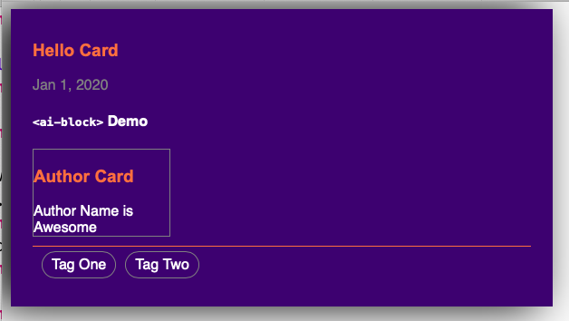

# `<ai-block>` Web Component example

Execute this command bellow on Terminal

```bash
python2 -m SimpleHTTPServer # Or another WebServer
```

Open http://localhost:8080/ in your browser

You can see something two blocks with title and contents.


